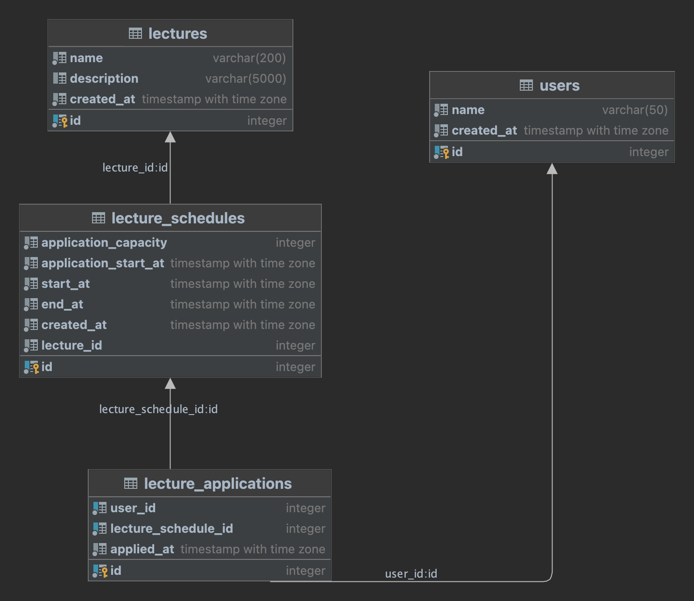

# FCFS Lecture Application

## 개요

선착순 수강 신청 시스템을 구현하기 위한 백엔드 애플리케이션입니다.

## 주요 고려 사항

- 동시성 제어를 위한 비관적 락 사용
  - 선착순 수강 신청 서비스에 성격상 특정 시간에 트래픽이 몰려 충돌이 많이 발생할 것으로 예상되었습니다.
  - 충돌이 많이 발생할 경우 낙관적 락은 에러 핸들링 혹은 재시도 로직등을 고려해야 하며, 이로 인해 성능이 저하될 수 있다고 판단했습니다.
  - 비관적 락은 내부적으로 Queue를 통해 Transaction을 관리하기 때문에 요청에 의한 순차처리도 가능하여 더 적합하다고 판단했습니다.
- 데이터 베이스 설계 (ERD)
  - 비관적 락을 통한 동시성 처리로 인해 DeadLock 등의 문제가 발생하지 않게 고려했습니다.
  - 강의의 최대 수용 인원과 현재 수강 신청 인원만을 따로 관리하는 `lecture_capacities` 테이블을 통해 최소한의 리소스로 락을 제어했습니다.
  - `lecture_capacities` 테이블에서 일부 역정규화 (lecture_id)를 통해 Join을 줄이는 방향을 고려했습니다.

## ERD 다이어그램

## API 목록

- 강의 생성 (`POST /lectures`)
- 강의 스케줄 수강 신청 (`POST /lectures/apply`)
- 강의 스케줄 생성 (`POST /lectures/:lectureId/schedules`)
- 강의 스케줄 목록 조회 (`GET /lectures`)
- 사용자 수강 신청 목록 조회 (`GET /lectures/application/:userId`)
