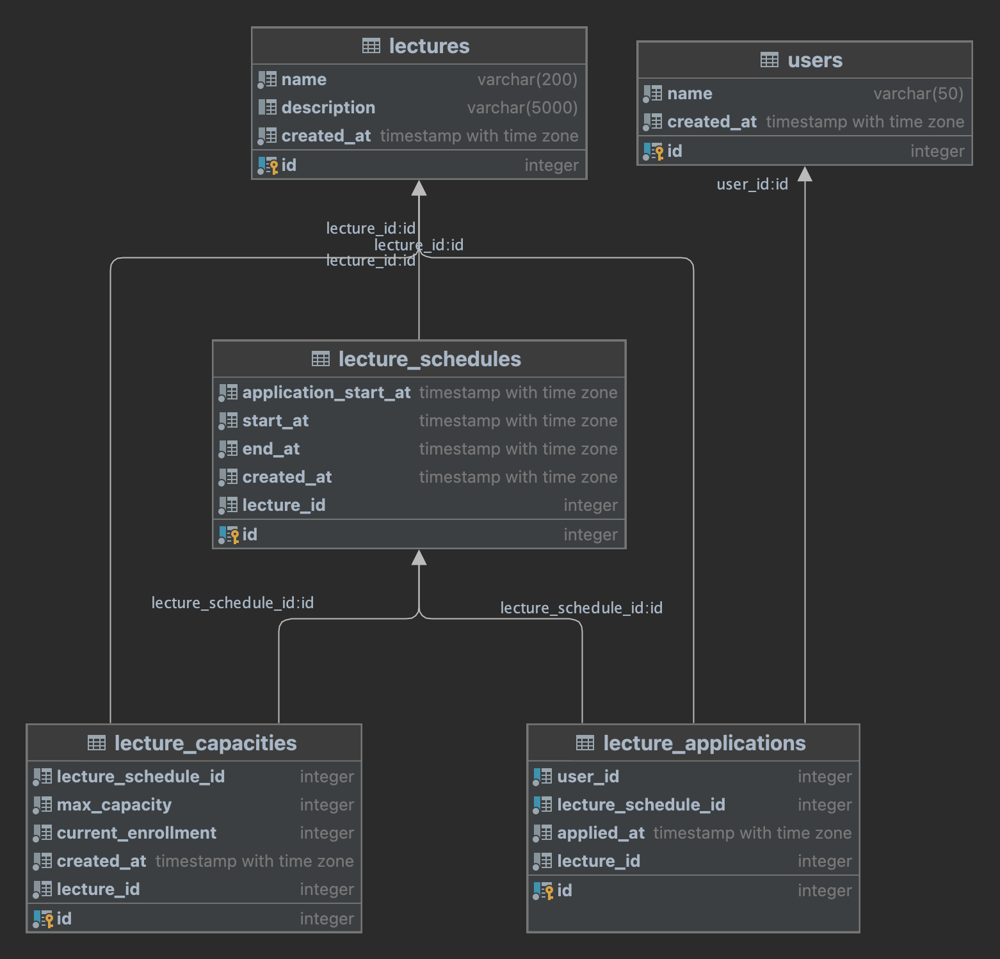

# FCFS Lecture Application

## 개요

선착순 수강 신청 시스템을 구현하기 위한 백엔드 애플리케이션입니다.

## 주요 기능

- 강의 및 스케줄 생성
- 사용자 수강 신청
- 수강 신청 강의 스케줄 목록 조회
- 동시성 제어를 위한 비관적 락 사용

## ERD 다이어그램

## API 목록

- 강의 생성 (`POST /lectures`)
- 강의 스케줄 수강 신청 (`POST /lectures/apply`)
- 강의 스케줄 생성 (`POST /lectures/:lectureId/schedules`)
- 강의 스케줄 목록 조회 (`GET /lectures`)
- 사용자 수강 신청 목록 조회 (`GET /lectures/application/:userId`)
